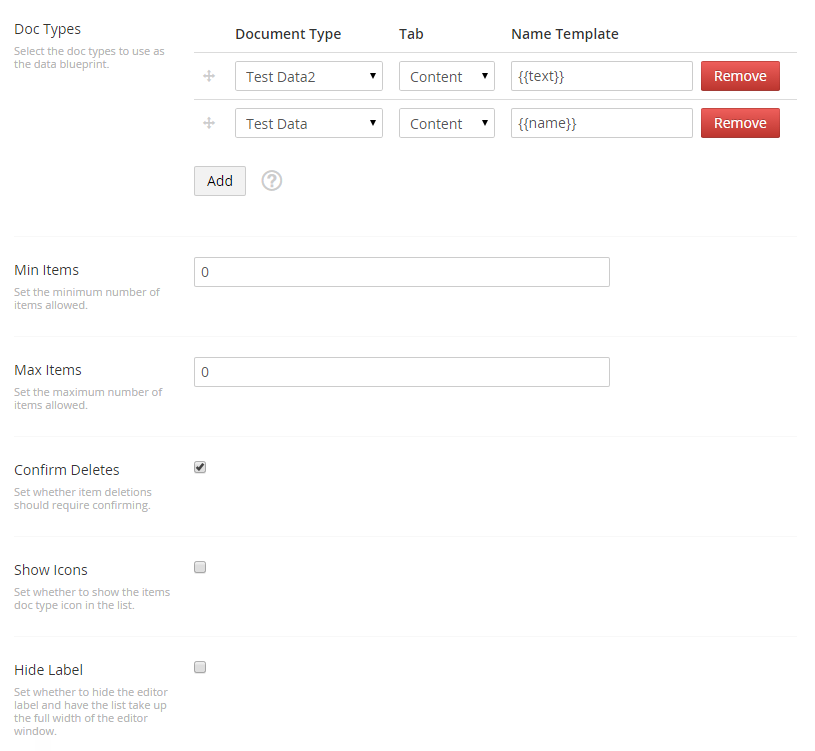
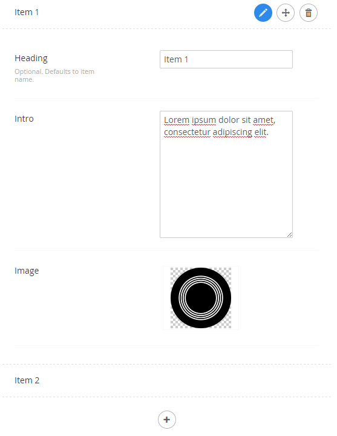
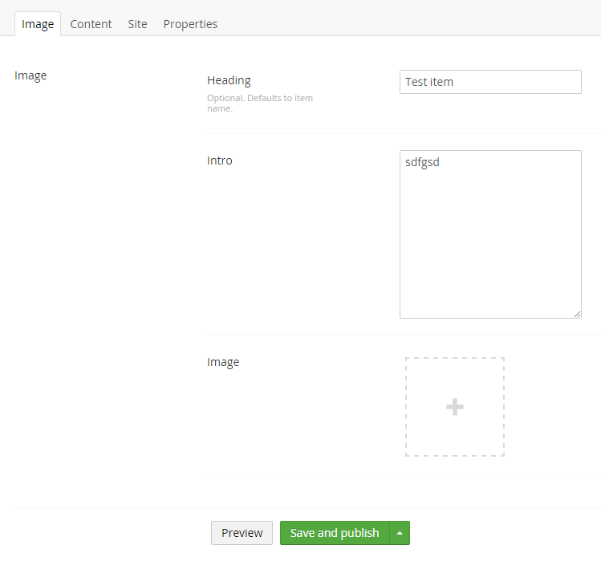

# Nested Content - Developers Guide

### Contents

1. [Introduction](#introduction]
2. [Getting Set Up](#getting-set-up)
  * [System Requirements](#system-requirements)
3. [Configuring Nested Content](#configuring-nested-content)
4. [Editing Nested Content](#editing-nested-content)
  * [Single Item Mode](#single-item-mode)
5. [Rendering Nested Content](#rendering-nested-content)
  * [Single Item Mode](#single-item-mode-1)
6. [Useful Links](#useful-links)

---

### Introduction

**Nested Content** is a new list editing property editor for Umbraco 7+, similar to likes of **Embedded Content** and **Archetype**, however **Nested Content** uses the power of doc types to define the list item blue prints. By using doc types, we get the benefit of an easy / reusable UI we are all familiar with and also get to re-use all the standard data types as our field editors rather than being limited to a subset of "allowed" types.

**Nested Content** then is probably the last list editor you will need for Umbraco 7+.

---

### Getting Set Up

#### System Requirements

Before you get started, there are a number of things you will need:

1. .NET 4.5+
2. Umbraco 7.1.4+
3. The **Nested Content** package installed

---

### Configuring Nested Content

The **Nested Content** property editor is set-up/configured in the same way as any standard property editor, via the *Data Types* admin interface. To set-up your Nested Content property, create a new *Data Type* and select **Nested Content** from the list of available property editors.

You should then be presented with the **Nested Content** property editors prevalue editor as shown below.



The prevalue editor allows you to configure the following properties.

| Member          | Type    | Description |
|-----------------|---------|-------------|
| Doc Type        | List    | Selects the doc type you want to use as the blue print for your list items. |
| Tab             | String  | The alias of the tab you wish to use as your list item editor. If not set, the first non "Properties" tab will be used. |
| Label Template  | String  | An template to use for generating list item labels. Use the syntax `{{propertyAlias}}` to use the values of your doc type properties. If not set, defaults to a standard "Item 1", "Item 2", "Item 3" template. |
| Min Items       | Int     | Sets the minimum number of items that should be allowed in the list. If greater than 0, **Nested Content** will pre-populate your list with the minimum amount of allowed items and prevent deleting items below this level. Defaults to 0.
| Max Itemd       | Int     | Sets the maximum number of items that should be allowed in the list. If greater than 0, **Nested Content** will prevent new items being added to the list above this threshold. Defaults to 0. |
| Confirm Deletes | Boolean | Enabling this will require item deletions to require a confirmation before being deleted. Defaults to TRUE |
| Hide Label      | Boolean | Enabling this will hide the property editors label and expand the **Nested Content** property editor to the full with of the editor window. |

Once your data type has been configured, simply set-up a property on your page doc type using your new data type and you are set to start editing.

---

### Editing Nested Content

The **Nested Content** editor takes a lot of styling cues from the new Umbraco grid in order to keep consistency and a familiarity to content editors.

When viewing a **Nested Content** editor for the first time, you’ll be presented with a simple icon and help text to get you started.


Simply click the  icon and a new item will be added to the list with the editor form displayed.



More items can be added to the list by clicking the  icon for each additional item.

To close the editor for an item / open the editor for another item in the list, simply click the  icon.


To reorder the list, simply click and drag the  icon up and down to place the items in the order you want.

To delete an item simply click the  icon. If the minimum number of items is reached, then the  icon will appear greyed out to prevent going below the minimum allowed number of items.

#### Single Item Mode

If **Nested Content** is configured with a minimum and maximum item of 1, then it goes into single item mode.

In single item mode, there is no icon displayed to add new items, and the single items editor will be open by default and it’s header bar removed.

In this mode,** Nested Content** works more like a fieldset than a list editor.



---

### Rendering Nested Content

To render the stored value of your **Nested Content** property, a built in value convert is provided for you. Simply call the `GetPropertyValue<T>` method with a generic type of `IEnumerable<IPublishedContent>` and the stored value will be returned as a list of `IPublishedContent` entity.

Example:

```csharp
@inherits Umbraco.Web.Mvc.UmbracoViewPage
@{
	var items = Model.GetPropertyValue<IEnumerable<IPublishedContent>>("myProperyAlias");

	foreach(var item in items)
	{
		// Do your thang...
	}
}
```

Because we treat each item as a standard `IPublishedContent` entity, that means you can use all the property value converters you are used to using, as-well as the built in `@Umbraco.Field(...)` helper methods.

Example:
```csharp
@inherits Umbraco.Web.Mvc.UmbracoViewPage
@{
	var items = Model.GetPropertyValue<IEnumerable<IPublishedContent>>("myProperyAlias");

	foreach(var item in items)
	{
		<h3>@item.GetPropertyValue("name")</h3>
		@Umbraco.Field(item, "bodyText")
	}
}
```

#### Single Item Mode

If your **Nested Content** property editor is configured in single item mode then the value converter will automatically know this and will return a single `IPublishedContent` entity rather than an `IEnumerable<IPublishedContent>` list. Therefore, when using **Nested Content** in single item mode, you can simply call `GetPropertyValue<T>` with a generic type of `IPublishedContent` and you can start accessing the entities property straight away, rather than having to then fetch it from a list first.

Example:
```csharp
@inherits Umbraco.Web.Mvc.UmbracoViewPage
@{
	var item = Model.GetPropertyValue<IPublishedContent> ("myProperyAlias");
}
	<h3>@item.GetPropertyValue("name")</h3>
	@Umbraco.Field(item, "bodyText")
```

---

### Useful Links

* [Source Code](https://github.com/leekelleher/umbraco-nested-content)
* [Our Umbraco Project Page](http://our.umbraco.org/projects/backoffice-extensions/nested-content)